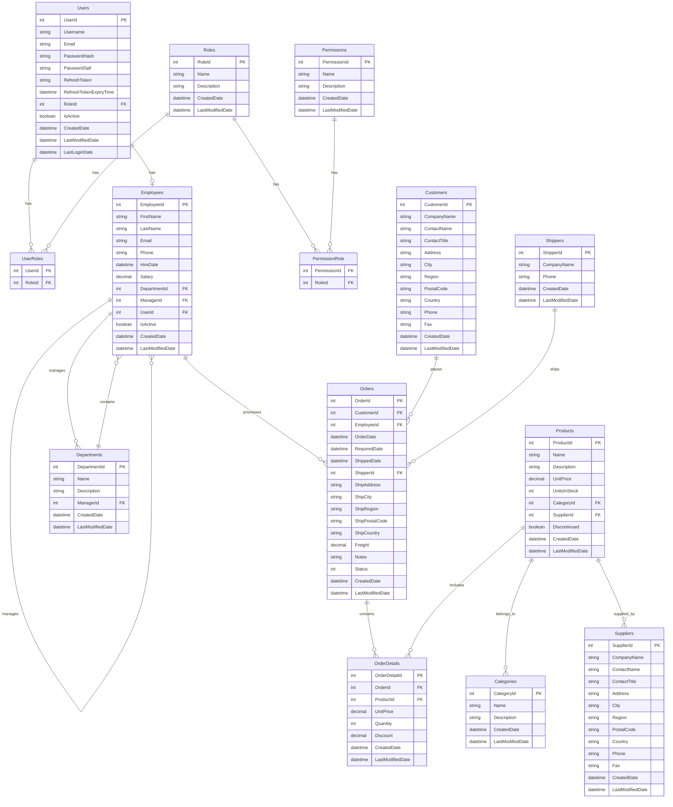

# AdvancedDB

## Database Schema (ERD)

```mermaid
erDiagram
    Users ||--o{ UserRoles : has
    Users ||--o| Employees : has
    Roles ||--o{ UserRoles : has
    Roles ||--o{ PermissionRole : has
    Permissions ||--o{ PermissionRole : has
    Employees ||--o{ Employees : manages
    Employees ||--o{ Orders : processes
    Employees ||--o{ Departments : manages
    Departments ||--o{ Employees : contains
    Customers ||--o{ Orders : places
    Orders ||--o{ OrderDetails : contains
    Products ||--o{ OrderDetails : includes
    Products ||--o{ Categories : belongs_to
    Products ||--o{ Suppliers : supplied_by
    Shippers ||--o{ Orders : ships

    Users {
        int UserId PK
        string Username
        string Email
        string PasswordHash
        string PasswordSalt
        string RefreshToken
        datetime RefreshTokenExpiryTime
        int RoleId FK
        boolean IsActive
        datetime CreatedDate
        datetime LastModifiedDate
        datetime LastLoginDate
    }

    Roles {
        int RoleId PK
        string Name
        string Description
        datetime CreatedDate
        datetime LastModifiedDate
    }

    Permissions {
        int PermissionId PK
        string Name
        string Description
        datetime CreatedDate
        datetime LastModifiedDate
    }

    Employees {
        int EmployeeId PK
        string FirstName
        string LastName
        string Email
        string Phone
        datetime HireDate
        decimal Salary
        int DepartmentId FK
        int ManagerId FK
        int UserId FK
        boolean IsActive
        datetime CreatedDate
        datetime LastModifiedDate
    }

    Departments {
        int DepartmentId PK
        string Name
        string Description
        int ManagerId FK
        datetime CreatedDate
        datetime LastModifiedDate
    }

    Customers {
        int CustomerId PK
        string CompanyName
        string ContactName
        string ContactTitle
        string Address
        string City
        string Region
        string PostalCode
        string Country
        string Phone
        string Fax
        datetime CreatedDate
        datetime LastModifiedDate
    }

    Orders {
        int OrderId PK
        int CustomerId FK
        int EmployeeId FK
        datetime OrderDate
        datetime RequiredDate
        datetime ShippedDate
        int ShipperId FK
        string ShipAddress
        string ShipCity
        string ShipRegion
        string ShipPostalCode
        string ShipCountry
        decimal Freight
        string Notes
        int Status
        datetime CreatedDate
        datetime LastModifiedDate
    }

    OrderDetails {
        int OrderDetailId PK
        int OrderId FK
        int ProductId FK
        decimal UnitPrice
        int Quantity
        decimal Discount
        datetime CreatedDate
        datetime LastModifiedDate
    }

    Products {
        int ProductId PK
        string Name
        string Description
        decimal UnitPrice
        int UnitsInStock
        int CategoryId FK
        int SupplierId FK
        boolean Discontinued
        datetime CreatedDate
        datetime LastModifiedDate
    }

    Categories {
        int CategoryId PK
        string Name
        string Description
        datetime CreatedDate
        datetime LastModifiedDate
    }

    Suppliers {
        int SupplierId PK
        string CompanyName
        string ContactName
        string ContactTitle
        string Address
        string City
        string Region
        string PostalCode
        string Country
        string Phone
        string Fax
        datetime CreatedDate
        datetime LastModifiedDate
    }

    Shippers {
        int ShipperId PK
        string CompanyName
        string Phone
        datetime CreatedDate
        datetime LastModifiedDate
    }

    UserRoles {
        int UserId FK
        int RoleId FK
    }

    PermissionRole {
        int PermissionId FK
        int RoleId FK
    }
```
